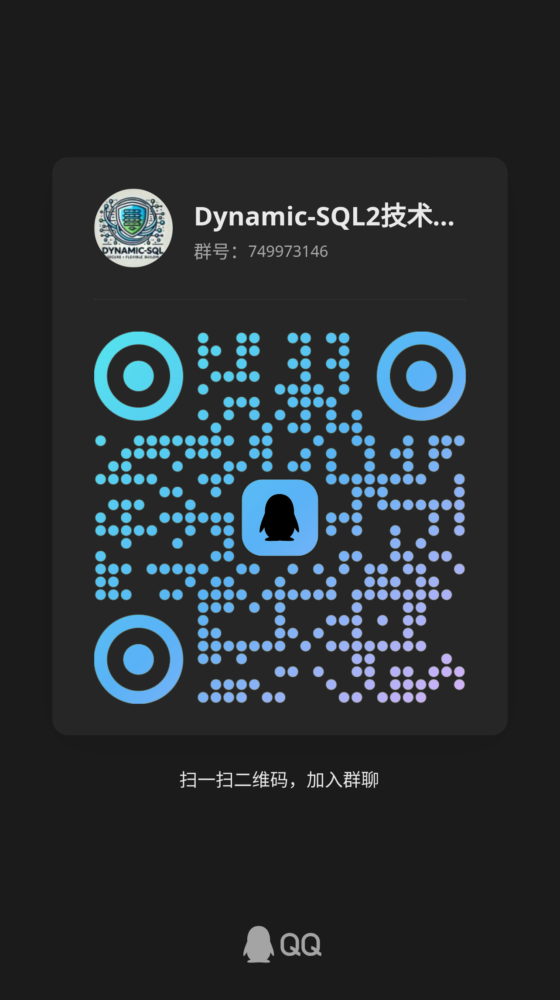

<p align="center">
    
</p>
<div align="center">安全 • 灵活 • 动态SQL构建框架</div>

# Dynamic-SQL2

`dynamic-sql2` 是一个灵活、安全的 Java 动态 SQL 构建框架，提供简洁的 DSL 风格接口，帮助开发者动态构建 SQL 查询。该框架支持与
MySQL、Oracle、DB2 等数据库的无缝集成，支持子查询、窗口函数、公共表表达式（CTE）、递归查询等高级 SQL 特性。

该项目旨在通过 Java API 抽象并屏蔽数据库特定的差异，同时保持可扩展性、灵活性和易用性。

> 旧版地址： https://github.com/pengweizhong/dynamic-sql

# 特性

- **动态 SQL 构建**：通过 Java API 动态构建复杂的 SQL 查询。
- **跨数据库兼容性**：支持 MySQL、Oracle、DB2 等主流数据库。
- **高级 SQL 支持**：支持子查询、窗口函数、公共表表达式（CTE）和递归查询。
- **分页功能**：现代化的分页功能，高效处理查询结果。
- **Spring 集成**：与 Spring、JDBC、MyBatis 灵活搭配

# 为什么需要 Dynamic-SQL2 ？

在开发应用时，特别是在处理数据库交互时，很多场景下需要根据不同的条件动态构建 SQL 查询。  
为了更加敏捷开发，dynamic-sql2 应运而生，解决了以下几个主要问题：

1. **减少硬编码 SQL 的重复性**  
   在传统的开发过程中，每个查询都需要手动编写 SQL 语句，这不仅增加了开发的复杂度，也导致了 SQL 语句的重复性。dynamic-sql2
   提供了简洁的
   DSL（领域特定语言）风格接口，使得动态构建 SQL 查询变得更加高效，减少了冗余代码，提升了开发效率。
2. **提升 SQL 生成的灵活性和可维护性**  
   动态构建 SQL 查询时，通常会面临不同条件、排序、分页等需求的变化，手动编写 SQL 会导致查询逻辑的分散和代码的复杂化。dynamic-sql2
   通过链式调用的方式，让开发者可以清晰、灵活地构建查询，避免了大量条件拼接带来的难度和错误。
3. **增强跨数据库兼容性**  
   不同的数据库系统有不同的 SQL 语法和特性，开发者通常需要为每种数据库编写不同的 SQL 查询，尤其是当系统支持多个数据库时，维护这些差异化的
   SQL 查询变得非常繁琐。dynamic-sql2 提供了统一的 SQL 构建方式，可以将数据库特性抽象出来，避免因数据库不同而引发的差异问题，实现“写一次，处处运行”的效果。
4. **优化复杂 SQL 的编写**  
   在一些复杂的查询场景中，如需要使用子查询、窗口函数、公共表表达式（CTE）或递归查询等，dynamic-sql2 提供了对这些高级 SQL
   特性的内置支持，使得开发者能够轻松生成复杂的查询语句。
5. **简化分页查询的实现**  
   分页查询是许多应用中的常见需求，传统分页查询往往需要处理复杂的 SQL 语句和大量的边界条件。dynamic-sql2
   提供了简单易用的分页功能，开发者只需传入页码和每页记录数，框架自动生成分页查询的 SQL，极大地简化了分页查询的实现。
6. **提升团队协作和代码一致性**  
   在一个团队中，手写 SQL 查询可能导致代码风格的不一致，给其他开发者带来理解和维护的困难。通过使用 dynamic-sql2，团队成员可以遵循统一的
   SQL 构建方式，确保代码的一致性和可读性，减少团队内部的沟通成本。
7. **支持灵活的扩展和定制**  
   dynamic-sql2 具有很好的扩展性，支持自定义函数、条件生成器等，能够根据项目的不同需求进行定制，适应复杂的业务场景。
8. **提高代码的测试性和可调试性**  
   由于 SQL 查询是通过 Java API 构建的，开发者可以轻松进行单元测试，验证 SQL 语句的正确性。dynamic-sql2
   提供的日志记录和调试支持也使得开发者能够更容易追踪
   SQL 查询的执行过程和调试问题。

# Dynamic-SQL2 不是什么 ？

动态SQL的定位是面向企业级`SAAS`系统开发，它的设计思想是专注于简化 `SQL` 构建和敏捷开发的轻量级的`ORM`框架，  
它补充了`Mybatis-plus`和`TK-Mybatis`不能多表连接的空白，并额外添加了许多实际应用场景的API，但仍不如像 `Mybatis` 或 `Hibernate` 那样提供全面的数据库操作。  
所以它不太适用于复杂的数据分析，即使有时`Dynamic-SQL2`支持特别复杂的SQL，但由于Java臃肿的语法，又想要保持低侵入的编码状态，这是无法避免的；  
过长的SQL构建语句会比较难以阅读，因此不建议在代码中构建特别复杂的`SQL`。
# 快速开始

https://github.com/pengweizhong/dynamic-sql2-spring-boot-starter

# 本地测试

## 1. 引入依赖

在 `pom.xml` 中添加以下依赖：

```xml

<dependency>
    <groupId>com.dynamic-sql</groupId>
    <artifactId>dynamic-sql2</artifactId>
    <version>0.2.1</version>
</dependency>
```

## 2. 配置基础参数

```java
public class InitializingContext {
    //使用此对象与数据库交互
    protected static SqlContext sqlContext;
    private static final Logger log = LoggerFactory.getLogger(InitializingContext.class);

    @BeforeAll
    static synchronized void setUp() {
       if (sqlContext != null) {
          log.info("--------------------- SqlContext 已被初始化 ---------------------");
          return;
       }
       SqlContextProperties sqlContextProperties = SqlContextProperties.defaultSqlContextProperties();
       sqlContextProperties.setScanTablePackage("com.dynamic.sql.entites");
       sqlContextProperties.setScanDatabasePackage("com.dynamic.sql");
       //提供Mapper代理，但是与Mybatis不兼容，因此推荐使用SqlContext
       sqlContextProperties.setScanMapperPackage("com.dynamic.sql");
       SchemaProperties schemaProperties = new SchemaProperties();
       //本地数据源名称
       schemaProperties.setDataSourceName("dataSource");
       //设置全局默认数据源
       schemaProperties.setGlobalDefault(true);
       schemaProperties.setUseSchemaInQuery(true);
       //可以直接指定SQL方言
       //schemaProperties.setSqlDialect(SqlDialect.ORACLE);
       //指定特定的版本号，不同的版本号语法可能不同
       //schemaProperties.setDatabaseProductVersion("11.0.0.1");
       schemaProperties.setUseAsInQuery(true);
       schemaProperties.setCheckSqlInjection(true);
       //打印SQL
       SqlLogProperties sqlLogProperties = new SqlLogProperties();
       sqlLogProperties.setEnabled(true);
       sqlLogProperties.setPrintExecutionTime(true);
       sqlLogProperties.setLogger(new DefaultSqlLogger());
       sqlLogProperties.setLevel(LogLevel.INFO);
       schemaProperties.setSqlLogProperties(sqlLogProperties);
       sqlContextProperties.addSchemaProperties(schemaProperties);
       //内置分页
       sqlContextProperties.addInterceptor(new PageInterceptorPlugin());
       sqlContextProperties.addInterceptor(new ExceptionPlugin(new DefaultSqlErrorHint()));
       //内置JDBC连接
       ConnectionHolder.setConnectionHandle(new SimpleConnectionHandle());
       ConverterUtils.putFetchResultConverter(JsonObject.class, new FetchJsonObjectConverter());
       //0.1.8起，自定义值库表解析器，这在同一实例相似业务下不同的命令库表命名规则时非常有用
       ValueParserRegistrar valueParserRegistrar = new ValueParserRegistrar();
       valueParserRegistrar.register(new DefaultValueParser());
       sqlContext = SqlContextHelper.createSqlContext(sqlContextProperties);
    }
}
```

## 3. 使用示例

```java

/**
 * 从多个表中提取用户及其订单相关的信息，包括用户的总花费、订单数量、所购买的产品及其分类等；
 * <p/>
 * SQL生成的如下：
 * <pre>
 * {@code
 * SELECT
 *     u.user_id,
 *     u.name AS user_name,
 *     user_total.total_spent,
 *     user_total.total_orders,
 *     p.product_name,
 *     p.price,
 *     cat.category_name,
 *     p.stock
 * FROM users u
 * -- 子查询：计算每个用户的总花费和订单数量
 * JOIN (
 *     SELECT
 *         o.user_id,
 *         SUM(o.total_amount) AS total_spent,
 *         COUNT(o.order_id) AS total_orders
 *     FROM orders o
 *     GROUP BY o.user_id
 * ) AS user_total ON u.user_id = user_total.user_id  -- 关联用户和子查询结果
 * LEFT JOIN orders o ON u.user_id = o.user_id  -- 左连接订单
 * LEFT JOIN (
 *     SELECT
 *         p.product_id,
 *         p.product_name,
 *         p.price,
 *         p.category_id,
 *         p.stock,  -- 包含 stock 字段
 *         jt.order_id
 *     FROM products p
 *     JOIN (
 *         SELECT
 *             o.order_id,
 *             jt.product_name
 *         FROM orders o
 *         JOIN JSON_TABLE(o.order_details, '$.items[*]'
 *             COLUMNS (product_name VARCHAR(150) PATH '$.product')) AS jt
 *     ) AS jt ON jt.product_name = p.product_name
 * ) AS p ON o.order_id = p.order_id  -- 连接产品
 * LEFT JOIN categories cat ON p.category_id = cat.category_id  -- 关联产品和分类
 * WHERE user_total.total_spent > 100  -- 只选择花费超过 100 的用户
 * ORDER BY user_total.total_spent DESC  -- 按照总花费降序排列
 * LIMIT 0, 500;  -- 限制返回结果的行数
 * }
 * </pre>
 */
@Test
void select1() {
    sqlContext.select()
            .column(User::getUserId)
            .column(User::getName, "user_name")
            .column("user_total", "total_spent")
            .column("user_total", "total_orders")
            .column("p", Product::getProductName)
            .column("p", Product::getPrice)
            .column("p", Product::getStock)
            .column(Category::getCategoryName)
            .from(User.class)
            .join(select -> select
                            .column(Order::getUserId)
                            .column(new Sum(Order::getTotalAmount), "total_spent")
                            .column(new Count(Order::getOrderId), "total_orders")
                            .from(Order.class)
                            .groupBy(Order::getUserId)
                    , "user_total",
                    condition -> condition.andEqualTo(User::getUserId, bindAlias("user_total", Order::getUserId))
            )
            .leftJoin(Order.class, condition -> condition.andEqualTo(User::getUserId, Order::getUserId))
            .leftJoin(select -> select
                    .column(Product::getProductId)
                    .column(Product::getProductName)
                    .column(Product::getPrice)
                    .column(Product::getCategoryId)
                    .column(Product::getStock)
                    .column("jt", Order::getOrderId)
                    .from(Product.class)
                    .join(select1 -> select1
                                    .column("o", Order::getOrderId)
                                    .column("jt", Product::getProductName)
                                    .from(Order.class, "o")
                                    .join(() -> new JsonTable("o", "order_details", "$.items[*]",
                                            JsonColumn.builder().column("product_name").dataType("VARCHAR(150)").jsonPath("$.product").build()
                                    ), "jt"),
                            "jt", condition -> condition.andEqualTo(bindAlias("jt", Product::getProductName), Product::getProductName)
                    ), "p", condition -> condition.andEqualTo(Order::getOrderId, bindAlias("p", Order::getOrderId)))
            .leftJoin(Category.class, condition -> condition.andEqualTo(bindAlias("p", Category::getCategoryId), Category::getCategoryId))
            .where(condition -> condition.andGreaterThan(bindAlias("user_total", "total_spent"), 100))
            .orderBy("user_total", "total_spent", SortOrder.DESC)
            .limit(0, 500)
            .fetch().toList();
}

/**
 * 简单的函数计算
 */
@Test
void select2() {
    // ROUND(COUNT(*) * 100.0 / (SELECT COUNT(*) FROM t_pro_ret_phased), 2) AS percentage
    ExamResult percentage = sqlContext.select()
            .column(new Round(new Count(1).multiply(100).divide(
                    nestedSelect -> {
                        nestedSelect.select().column(new Count(1)).from(Student.class);
                    }), 2), "percentage")
            .from(ExamResult.class)
            .orderByField(">10%", "5~10%", "0~5%", "0%", "<-10%")
            .fetch().toOne();
    System.out.println(percentage);
}

/**
 * 构建分页查询
 */
@Test
void select3() {
    //提取查询方法可以重复利用
    Supplier<List<Product>> selectSupplier = () -> sqlContext.select()
            .allColumn()
            .from(Product.class)
            .fetch().toList();
    //List 分页
    PageInfo<List<Product>> listPageInfo = PageHelper.of(1, 12).selectPage(selectSupplier);
    System.out.println(listPageInfo);
    while (listPageInfo.hasNextPage()) {
        System.out.println(listPageInfo.hasPreviousPage());
        System.out.println(listPageInfo.selectNextPage(selectSupplier));
    }
    System.out.println("======================================================");
    //Map 分页
    PageInfo<Map<Integer, String>> mapPageInfo = PageHelper.of(1, 9)
            .selectPage(() -> sqlContext.select()
                    .column(Product::getProductId)
                    .column(Product::getProductName)
                    .from(Product.class)
                    .fetch(ProductView.class).toMap(ProductView::getProductId, ProductView::getProductName));
    System.out.println(mapPageInfo);
}

/**
 * 对查询结果组装为业务需要的对象
 */
@Test
void select4() {
    Map<Integer, HashSet<String>> groupingBy = sqlContext.select()
            .distinct()
            .allColumn()
            .from(User.class)
            .fetch()
            .toGroupingBy(User::getUserId,
                    user -> user.getName() + "_hello",
                    HashSet::new,
                    ConcurrentHashMap::new);
    System.out.println(groupingBy);
}


/**
 * 列表一对多查询
 */
@Test
void selectCollection() {
   List<CategoryView> list = selectCollectionList();
   System.out.println(list.size());
   list.forEach(System.out::println);
}

/**
 * 分页支持一对多查询
 */
@Test
void selectCollectionPage() {
   PageInfo<List<CategoryView>> pageInfo = PageHelper.of(1, 10).selectPage(this::selectCollectionList);
   System.out.println(pageInfo);
}

List<CategoryView> selectCollectionList() {
   return sqlContext.select()
           .column(Category::getCategoryId)
           .column(Category::getCategoryName)
           .column(Category::getDescription)
           .collectionColumn(
                   KeyMapping.of(Category::getCategoryId, Product::getCategoryId),
                   valueMapping -> valueMapping
                           //-- 如果想在子表中使用关联键，那么直接在类型定义即可，无需重复查询
//                                .column(Product::getCategoryId)
                           .column(Product::getProductId)
                           .column(Product::getProductName),
                   "productVOS"
           )
           //也可用于数据去重，等效于 Distinct(Category::getCategoryId)，但不推荐这么使用
//                .collectionColumn(
//                        KeyMapping.of(Category::getCategoryId, Category::getCategoryId),
//                        valueMapping -> valueMapping,
//                        "productVOS"
//                )
           .from(Category.class)
           .join(Product.class, on -> on.andEqualTo(Category::getCategoryId, Product::getCategoryId))
           .fetch(CategoryView.class)
           .toList();
}

```

# 使用方法

### 1. 构建查询

### 2. 支持的 SQL 特性

#### 1. 子查询（Subquery）

#### 2. 窗口函数（Window Functions）

#### 3. 公共表表达式（CTE）

### 3. 分页功能

# 重复造轮子？
本项目针对“动态 SQL + 纯 Java 构建 + 跨库兼容 + 低侵入”做的优化，实用性强，属于“轻量创新型轮子”，不算重复体力活。  
主要特点：  
✅ 轻量级、纯 Java 链式 SQL 构建工具  
✅ 侧重动态 SQL、跨数据库兼容、低侵入  
✅ 补足了 MyBatis、JOOQ、QueryDSL、JDBC Template 等现有方案的盲区

> 下列表格由 ChatGPT 生成，仅仅供参考

| 功能/特性       | Dynamic-SQL2 | MyBatis Plus | JOOQ        | QueryDSL   | JDBC Template |
|-------------|--------------| ------------ |-------------|------------| ------------- |
| 纯 Java 链式构建 | ✅            | 部分 Lambda 支持 | ✅（生成代码）     | ✅（实体绑定）    | ❌ 手写 SQL      |
| 动态 SQL 拼接   | ✅ 完全动态       | 部分支持         | 支持但依赖生成     | 一般，灵活度受限   | 手动字符串拼接       |
| 子查询 / 窗口函数  | ✅ 内置支持       | 需手动拼接        | ✅ 强支持       | 一般         | 手动拼接          |
| 跨库方言封装      | ✅ 内置         | 手动适配         | ✅ 支持        | 一般，底层依赖数据库 | 手动适配          |
| 分页、拦截器      | ✅ 内置统一机制     | 需单独配置插件      | 商业版支持       | 需手写        | 手写            |
| 侵入性         | 低，独立使用       | 中等           | 高，依赖代码生成    | 中等，绑定实体    | 极低，裸 SQL      |
| 典型应用场景      | 传统业务系统       | 传统业务系统       | 严格类型 SQL 场景 | ORM 查询补充   | 简单小型项目        |
| 是否全面覆盖复杂 SQL 场景 | ✅ 高度覆盖              | 部分覆盖，复杂 SQL 受限  | ✅ 全面支持               | 部分支持，灵活性不足     | 需手动拼接、易出错 |
# 贡献

欢迎提交 Pull Request 或在 Issues 中反馈问题。

# 许可证

该项目使用 MIT 许可证。

# QQ交流群
<p align="left">
    
</p>


# 开源支持

感谢 [JetBrains](https://www.jetbrains.com/) 提供的开源许可证支持。

