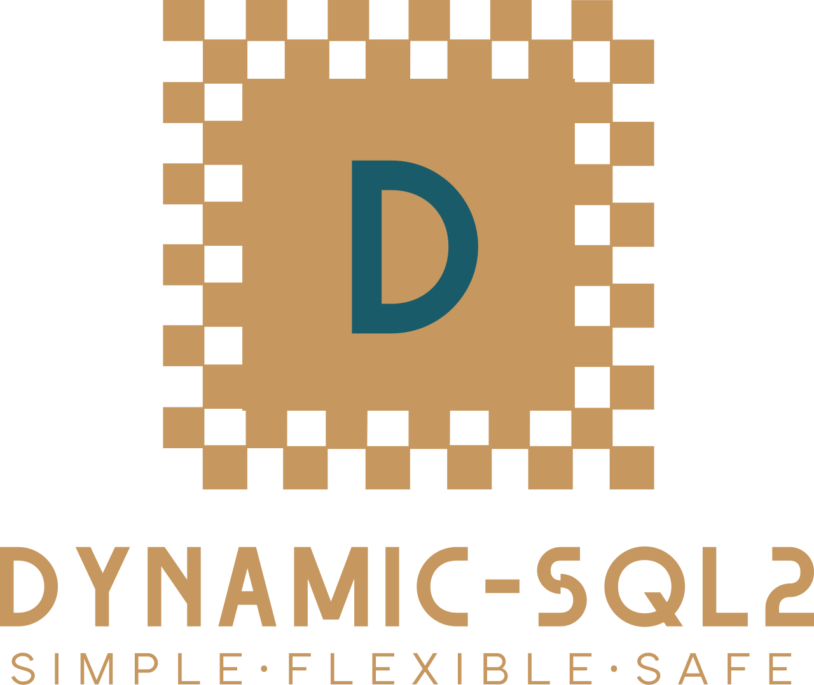

<p align="center">
  
</p>


<div align="center">
  <strong>简单 • 灵活 • 安全 &nbsp;&nbsp;&nbsp;&nbsp;&nbsp; 新一代 Java 动态 SQL 构建框架</strong>
</div>
<br>

<p align="center">
  
  
  
  
  
  
  
  
  
  
  
  
  
</p>


# ✨ Dynamic-SQL2 是什么？

`Dynamic-SQL2` 是一个 **纯 Java、低侵入、跨数据库、可组合的动态 SQL 构建框架**。 它提供 **优雅的 DSL 风格 API**，让你可以像写代码一样构建 SQL，同时保持 SQL 的表达力与可控性。

它不是完整的 ORM，也不是 MyBatis 的替代品，而是 `Lightweight ORM` / `Micro ORM`：

> **补足传统 ORM 在“动态 SQL + 多表查询 + 跨库兼容 + 类型检查”上的空白和拓展。**

适用于 **企业级业务系统、SaaS 平台、多租户架构、复杂动态查询场景**。

# 🔥 核心特性

- **动态 SQL 构建**：链式 DSL，告别字符串拼接
- **跨数据库兼容**：内置 MySQL / Oracle / DB2 方言
- **高级 SQL 支持**：子查询、窗口函数、CTE、递归查询
- **现代化分页**：支持 List / Map / 一对多结构分页
- **Spring 友好**：可与 Spring、JDBC、MyBatis 灵活组合
- **可扩展性强**：自定义函数、条件生成器、值解析器
- **可测试性强**：SQL 由 Java 构建，天然适合单元测试
- **专业日志模块**：结构化、可自定义、可读性极高的 SQL 输出
- **提升团队协作和代码一致性**：遵循统一的 SQL 构建方式，确保代码的一致性和可读性

# 🎯 为什么需要 Dynamic-SQL2？

在真实业务中，SQL 很少是静态不变的。随着条件组合、分页、排序、权限控制、多租户、动态列、跨库兼容等需求不断叠加，动态构建 SQL 已经成为后端开发的日常工作。  

传统方式在不同场景下各有优势，但在“动态 SQL + 多表组合 + 跨库兼容”这一类需求上往往需要额外处理：

传统方式的问题：

| 方式          | 特点与适用场景                                           |
| ------------- | -------------------------------------------------------- |
| JDBC Template | 灵活度最高，适合简单查询或对 SQL 完全可控的场景          |
| MyBatis XML   | 结构清晰，适合复杂 SQL；简单业务场景下需要配置较多代码   |
| MyBatis-Plus  | CRUD 快速开发友好；在复杂动态查询上需要额外扩展          |
| Dynamic‑SQL2  | 专注动态 SQL 构建，纯 Java DSL，可组合、可测试、跨库友好 |

Dynamic‑SQL2 的价值在于补足这块“灰色地带”

> **让动态 SQL 变得优雅、可维护、可组合、可测试。**

Dynamic‑SQL2 的定位不是替代 MyBatis，也不是为了“减少 SQL”，而是为了：

- **更自由地构建 SQL**（无需 XML、无需注解、无需字符串拼接）
- **更安全地管理条件**（自动忽略 null、自动参数化）
- **更高效地复用查询逻辑**（可组合、可抽象、可扩展）
- **更自然地支持跨数据库**（统一 DSL，方言可扩展）

> **在“动态 SQL + 纯 Java 构建 + 跨库兼容”这一类需求上提供更轻量、更自由、更安全、更直接的解决方案。**

# ❌ Dynamic-SQL2 不是什么？

- 不是全功能 ORM，而是 `Lightweight ORM` / `Micro ORM`（更多是组合现有框架的低侵入拓展）
- 不适合超复杂的数据分析（Java DSL 写太长会影响可读性，即使 Dynamic-SQL2 支持）
- 不追求替代 MyBatis / Hibernate，而是在此基础上的功能增强

# 🛠️ 重复造轮子？

很多人看到“动态 SQL 框架”会下意识觉得是重复造轮子。 但 Dynamic-SQL2 的定位非常明确：

- **动态 SQL 构建**（不是固定 SQL）
- **纯 Java DSL**（不是 XML、不是注解）
- **跨数据库兼容**（不是单一方言）
- **低侵入、轻量化**（不是 ORM 全家桶）
- **独立框架**（直接基于 JDBC ）

这些组合在一起，其实是一个**很实际、但长期被忽略的需求点，尤其是在敏捷开发的场景**。

你可以这样理解：

- MyBatis：动态能力强，但 XML 复杂
- MyBatis-Plus：简单，但多表和动态 SQL 能力有限
- JOOQ：强大，但太重、侵入性高
- JDBC Template：灵活，但字符串拼接痛苦

Dynamic-SQL2 的位置刚好在它们之间的“空白地带”：

> **让动态 SQL 更简单，让跨库更自然，让 DSL 更轻量。**

这不是重复，也不是替代，而是补位。

# 📘 快速开发预览（部分API）

> 对于SpringBoot，请参考：https://github.com/pengweizhong/dynamic-sql2-spring-boot-starter
>
> 对于Dynamic-SQL2拓展，请参考：https://github.com/pengweizhong/dynamic-sql2-extension

## 1. 引入依赖

在 `pom.xml` 中添加以下依赖：

```xml
<dependency>
    <groupId>com.dynamic-sql</groupId>
    <artifactId>dynamic-sql2</artifactId>
    <version>0.3.0</version>
</dependency>
```

## 2. 配置基础参数

```java
public class InitializingContext {
    //使用此对象与数据库交互
    protected static SqlContext sqlContext;
    private static final Logger log = LoggerFactory.getLogger(InitializingContext.class);

    @BeforeAll
    static synchronized void setUp() {
       if (sqlContext != null) {
          log.info("--------------------- SqlContext 已被初始化 ---------------------");
          return;
       }
       SqlContextProperties sqlContextProperties = SqlContextProperties.defaultSqlContextProperties();
       sqlContextProperties.setScanTablePackage("com.dynamic.sql.entites");
       sqlContextProperties.setScanDatabasePackage("com.dynamic.sql");
       //提供Mapper代理，但是与Mybatis不兼容，因此推荐使用SqlContext
       sqlContextProperties.setScanMapperPackage("com.dynamic.sql");
       SchemaProperties schemaProperties = new SchemaProperties();
       //本地数据源名称
       schemaProperties.setDataSourceName("dataSource");
       //设置全局默认数据源
       schemaProperties.setGlobalDefault(true);
       schemaProperties.setUseSchemaInQuery(true);
       //可以直接指定SQL方言
       //schemaProperties.setSqlDialect(SqlDialect.ORACLE);
       //指定特定的版本号，不同的版本号语法可能不同
       //schemaProperties.setDatabaseProductVersion("11.0.0.1");
       schemaProperties.setUseAsInQuery(true);
       schemaProperties.setCheckSqlInjection(true);
       //打印SQL
       SqlLogProperties sqlLogProperties = new SqlLogProperties();
       sqlLogProperties.setEnabled(true);
       sqlLogProperties.setPrintExecutionTime(true);
       sqlLogProperties.setLogger(new DefaultSqlLogger());
       sqlLogProperties.setLevel(LogLevel.INFO);
       schemaProperties.setSqlLogProperties(sqlLogProperties);
       sqlContextProperties.addSchemaProperties(schemaProperties);
       //内置分页
       sqlContextProperties.addInterceptor(new PageInterceptorPlugin());
       sqlContextProperties.addInterceptor(new ExceptionPlugin(new DefaultSqlErrorHint()));
       //内置JDBC连接
       ConnectionHolder.setConnectionHandle(new SimpleConnectionHandle());
       ConverterUtils.putFetchResultConverter(JsonObject.class, new FetchJsonObjectConverter());
       //0.1.8起，自定义值库表解析器，这在同一实例相似业务下不同的命令库表命名规则时非常有用
       ValueParserRegistrar valueParserRegistrar = new ValueParserRegistrar();
       valueParserRegistrar.register(new DefaultValueParser());
       sqlContext = SqlContextHelper.createSqlContext(sqlContextProperties);
    }
}
```

## 3. 使用示例

```java
/**
 * 简单的函数计算
 */
@Test
void select2() {
    // ROUND(COUNT(*) * 100.0 / (SELECT COUNT(*) FROM t_pro_ret_phased), 2) AS percentage
    ExamResult percentage = sqlContext.select()
            .column(new Round(new Count(1).multiply(100).divide(
                    nestedSelect -> {
                        nestedSelect.select().column(new Count(1)).from(Student.class);
                    }), 2), "percentage")
            .from(ExamResult.class)
            //支持非查询列字段排序
            .orderByField(">10%", "5~10%", "0~5%", "0%", "<-10%")
            .fetch().toOne();
    System.out.println(percentage);
}

/**
 * 构建分页查询
 */
@Test
void select3() {
    //提取查询方法可以重复利用
    Supplier<List<Product>> selectSupplier = () -> sqlContext.select()
            .allColumn()
            .from(Product.class)
            .fetch().toList();
    //List 分页
    PageInfo<List<Product>> listPageInfo = PageHelper.of(1, 12).selectPage(selectSupplier);
    System.out.println(listPageInfo);
    while (listPageInfo.hasNextPage()) {
        System.out.println(listPageInfo.hasPreviousPage());
        System.out.println(listPageInfo.selectNextPage(selectSupplier));
    }
    System.out.println("======================================================");
    //Map 分页
    PageInfo<Map<Integer, String>> mapPageInfo = PageHelper.of(1, 9)
            .selectPage(() -> sqlContext.select()
                    .column(Product::getProductId)
                    .column(Product::getProductName)
                    .from(Product.class)
                    .fetch(ProductView.class)
                    .toMap(ProductView::getProductId, ProductView::getProductName));
    System.out.println(mapPageInfo);
}

/**
 * 对查询结果组装为业务需要的对象
 */
@Test
void select4() {
    Map<Integer, HashSet<String>> groupingBy = sqlContext.select()
            .distinct()
            .allColumn()
            .from(User.class)
            .fetch()
            .toGroupingBy(User::getUserId,
                    user -> user.getName() + "_hello",
                    HashSet::new,
                    ConcurrentHashMap::new);
    System.out.println(groupingBy);
}


/**
 * 列表一对多查询
 */
@Test
void selectCollection() {
    List<CategoryView> list = selectCollectionList();
    System.out.println(list.size());
    list.forEach(System.out::println);
}

/**
 * 分页支持一对多查询
 */
@Test
void selectCollectionPage() {
    PageInfo<List<CategoryView>> pageInfo = PageHelper.of(1, 10).selectPage(this::selectCollectionList);
    System.out.println(pageInfo);
}

List<CategoryView> selectCollectionList() {
    return sqlContext.select()
            .column(Category::getCategoryId)
            .column(Category::getCategoryName)
            .column(Category::getDescription)
            .collectionColumn(
                    KeyMapping.of(Category::getCategoryId, Product::getCategoryId),
                    valueMapping -> valueMapping
                            //-- 如果想在子表中使用关联键，那么直接在类型定义即可，无需重复查询
//                                .column(Product::getCategoryId)
                            .column(Product::getProductId)
                            .column(Product::getProductName),
                    "productVOS"
            )
            //也可用于数据去重，等效于 Distinct(Category::getCategoryId)，但不推荐这么使用
//                .collectionColumn(
//                        KeyMapping.of(Category::getCategoryId, Category::getCategoryId),
//                        valueMapping -> valueMapping,
//                        "productVOS"
//                )
            .from(Category.class)
            .join(Product.class, on -> on.andEqualTo(Category::getCategoryId, Product::getCategoryId))
            .fetch(CategoryView.class)
            .toList();
}

/**
 * 日期函数 DateFormat / Now
 */
@Test
void selectYearMonth() {
    YearMonth yearMonth = sqlContext.select()
            .column(new DateFormat(new Now(), "%Y-%m"))
            .from(Dual.class)
            .fetch(YearMonth.class)
            .toOne();
}

/**
 * 函数任意嵌套拓展
 */
@Test
void selectRoundSum() {
    Map<String, Object> result = sqlContext.select()
            .column(new Round(new Sum(User::getUserId), 3).divide(2))
            .column(new Round(new Sum(User::getUserId).divide(2), 3))
            .column(new Round(new Sum(User::getUserId).divide(new Count(User::getUserId)), 3))
            .from(User.class)
            .fetchOriginalMap()
            .toOne();
}

/**
 * 复杂查询效果：从多个表中提取用户及其订单相关的信息，包括用户的总花费、订单数量、所购买的产品及其分类等；
 * <p/>
 * SQL生成的如下：
 * <pre>
 * {@code
 * SELECT
 *     u.user_id,
 *     u.name AS user_name,
 *     user_total.total_spent,
 *     user_total.total_orders,
 *     p.product_name,
 *     p.price,
 *     cat.category_name,
 *     p.stock
 * FROM users u
 * -- 子查询：计算每个用户的总花费和订单数量
 * JOIN (
 *     SELECT
 *         o.user_id,
 *         SUM(o.total_amount) AS total_spent,
 *         COUNT(o.order_id) AS total_orders
 *     FROM orders o
 *     GROUP BY o.user_id
 * ) AS user_total ON u.user_id = user_total.user_id  -- 关联用户和子查询结果
 * LEFT JOIN orders o ON u.user_id = o.user_id  -- 左连接订单
 * LEFT JOIN (
 *     SELECT
 *         p.product_id,
 *         p.product_name,
 *         p.price,
 *         p.category_id,
 *         p.stock,  -- 包含 stock 字段
 *         jt.order_id
 *     FROM products p
 *     JOIN (
 *         SELECT
 *             o.order_id,
 *             jt.product_name
 *         FROM orders o
 *         JOIN JSON_TABLE(o.order_details, '$.items[*]'
 *             COLUMNS (product_name VARCHAR(150) PATH '$.product')) AS jt
 *     ) AS jt ON jt.product_name = p.product_name
 * ) AS p ON o.order_id = p.order_id  -- 连接产品
 * LEFT JOIN categories cat ON p.category_id = cat.category_id  -- 关联产品和分类
 * WHERE user_total.total_spent > 100  -- 只选择花费超过 100 的用户
 * ORDER BY user_total.total_spent DESC  -- 按照总花费降序排列
 * LIMIT 0, 500;  -- 限制返回结果的行数
 * }
 * </pre>
 */
@Test
void select1() {
    sqlContext.select()
            .column(User::getUserId)
            .column(User::getName, "user_name")
            .column("user_total", "total_spent")
            .column("user_total", "total_orders")
            .column("p", Product::getProductName)
            .column("p", Product::getPrice)
            .column("p", Product::getStock)
            .column(Category::getCategoryName)
            .from(User.class)
            .join(select -> select
                            .column(Order::getUserId)
                            .column(new Sum(Order::getTotalAmount), "total_spent")
                            .column(new Count(Order::getOrderId), "total_orders")
                            .from(Order.class)
                            .groupBy(Order::getUserId)
                    , "user_total",
                    condition -> condition.andEqualTo(User::getUserId, bindAlias("user_total", Order::getUserId))
            )
            .leftJoin(Order.class, condition -> condition.andEqualTo(User::getUserId, Order::getUserId))
            .leftJoin(select -> select
                    .column(Product::getProductId)
                    .column(Product::getProductName)
                    .column(Product::getPrice)
                    .column(Product::getCategoryId)
                    .column(Product::getStock)
                    .column("jt", Order::getOrderId)
                    .from(Product.class)
                    .join(select1 -> select1
                                    .column("o", Order::getOrderId)
                                    .column("jt", Product::getProductName)
                                    .from(Order.class, "o")
                                    .join(() -> new JsonTable("o", "order_details", "$.items[*]",
                                            JsonColumn.builder().column("product_name").dataType("VARCHAR(150)").jsonPath("$.product").build()
                                    ), "jt"),
                            "jt", condition -> condition.andEqualTo(bindAlias("jt", Product::getProductName), Product::getProductName)
                    ), "p", condition -> condition.andEqualTo(Order::getOrderId, bindAlias("p", Order::getOrderId)))
            .leftJoin(Category.class, condition -> condition.andEqualTo(bindAlias("p", Category::getCategoryId), Category::getCategoryId))
            .where(condition -> condition.andGreaterThan(bindAlias("user_total", "total_spent"), 100))
            .orderBy("user_total", "total_spent", SortOrder.DESC)
            .limit(0, 500)
            .fetch()
            .toList();
}

/**
 * 支持扁平化 union
 */
@Test
void testUnion() {
    List<UserBO> list = sqlContext.union(
                    select -> select.allColumn().from(User.class).where(where -> where.andEqualTo(User::getUserId, 1).limit(1)),
                    select -> select.allColumn().from(User.class).where(where -> where.andEqualTo(User::getUserId, 1)).orderBy(UserBO::getStatus),
                    select -> select.allColumn().from(User.class).where(where -> where.andEqualTo(User::getUserId, 2))
            )
            .thenOrderBy(UserBO::getUserId)
            .limit(1)
            .fetch(UserBO.class)
            .toList();
    list.forEach(System.out::println);
}

/**
 * 支持嵌套式 union
 */
@Test
void joinUnionAll() {
    List<UserBO> t = sqlContext.select()
            .allColumn("t")
            .fromUnionAll(
                    new SelectDsl[]{
                            select -> select.allColumn().from(User.class).where(where -> where.andEqualTo(User::getUserId, 1)),
                            select -> select.allColumn().from(User.class).where(where -> where.andEqualTo(User::getUserId, 2)),
                    }, "t")
            .join(User.class, on -> on.andEqualTo(User::getUserId, new Column("t", User::getUserId)))
            .leftJoinUnion(new SelectDsl[]{
                    select -> select.allColumn().from(User.class).where(where -> where.andEqualTo(User::getUserId, 3)),
                    select -> select.allColumn().from(User.class).where(where -> where.andEqualTo(User::getUserId, 4)),
            }, "s", on -> on.andEqualTo(User::getUserId, new Column("s", User::getUserId)))
            .where(where -> where
                    .andEqualTo(new Column("t", UserBO::getGender), "Male")
                    .andEqualTo(User::getUserId, 2)
            )
            .fetch(UserBO.class)
            .toList();
    t.forEach(System.out::println);
}

/**
 * 仅插入非空字段
 */
@Test
void insertSelective() {
    Product product = new Product();
    product.setProductName("菠萝手机-insertSelective");
    product.setPrice(BigDecimal.valueOf(6.66));
    product.setStock(666);
    product.setCreatedAt(new Date());
    product.setCategoryId(1);
    // 仅插入非空字段，保持 SQL 简洁
    int rows = sqlContext.insertSelective(product);
    System.out.println("影响行数：" + rows);
}

/**
 * 根据主键全字段更新
 */
@Test
void updateByPrimaryKey() {
    Product product = new Product();
    product.setProductId(20);
    product.setProductName("New Coffee Maker");
    product.setCategoryId(4);
    product.setCreatedAt(new Date());
    product.setPrice(BigDecimal.TEN);
    product.setStock(123);
    // 主键全字段更新
    int rows = sqlContext.updateByPrimaryKey(product);
    System.out.println(rows);
}


/**
 * 自动插入或更新
 */
@Test
void upsertMultiple() {
    List<Product> products = new ArrayList<>();
    for (int i = 1; i <= 5; i++) {
        Product product = new Product();
        product.setProductName("New Coffee Maker " + i);
        product.setCategoryId(4);
        product.setCreatedAt(new Date());
        product.setPrice(BigDecimal.TEN);
        product.setStock(123);
        products.add(product);
    }
    // 批量自动插入或更新
    int rows = sqlContext.upsertMultiple(products);
    System.out.println(rows);
}

/**
 * 根据条件删除
 */
@Test
void delete() {
    int i = sqlContext.delete(Product.class, where -> {
        where.andEqualTo(Product::getProductId, 1);
        where.orCondition(nestedWhere -> {
            nestedWhere.andEqualTo(Product::getProductId, 3);
            nestedWhere.orEqualTo(Product::getProductId, 4);
        });
    });
    System.out.println(i);
}

```

# 🤝 贡献指南

欢迎通过 Pull Request 提交改进，也欢迎在 Issues 中反馈使用中的问题或提出新特性建议。 无论是文档、示例、代码优化还是 Bug 修复，都非常欢迎参与。

# 📄 许可证

本项目基于 **MIT License** 开源，允许自由使用、修改和分发。

# 💬 社区交流

如果你在使用过程中遇到问题，或想与其他开发者交流，可以加入 QQ 群：

<p align="left">  </p>

# 🧡 开源支持

感谢 [JetBrains](https://www.jetbrains.com/) 提供的开源许可证支持。

